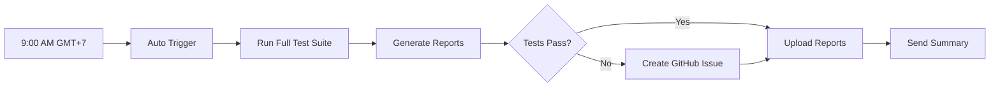

# 🎯 CI/CD Setup Summary

## ✅ Đã Setup Xong

### 📁 Files Đã Tạo

```
.github/
├── workflows/
│   ├── ci.yml                    # Main CI/CD pipeline
│   ├── scheduled-tests.yml       # Daily scheduled tests
│   └── README.md                 # Chi tiết về workflows
├── CICD_SETUP_GUIDE.md          # Hướng dẫn setup từng bước
└── CICD_SUMMARY.md              # File này - tóm tắt
```

---

## 🚀 Features Đã Implement

### 1. **Automatic Testing on Push** ✅
- ✅ Chạy tự động khi push code lên `main`, `develop`, `feature/**`, `bugfix/**`
- ✅ Chạy khi tạo Pull Request
- ✅ Test trên 2 phiên bản Node.js: 18 và 20
- ✅ Parallel execution để tăng tốc độ

### 2. **Daily Scheduled Tests** ✅
- ✅ Tự động chạy vào **9:00 AM GMT+7** mỗi ngày (2:00 AM UTC)
- ✅ Có thể chạy thủ công bất cứ lúc nào
- ✅ Tạo GitHub Issue tự động nếu tests fail

### 3. **Reports & Artifacts** ✅
- ✅ Playwright HTML Report - lưu 30 ngày
- ✅ Allure Report - auto deploy lên GitHub Pages
- ✅ Test results artifacts
- ✅ Test summary trong GitHub Actions

### 4. **Notifications** ✅
- ✅ Email notification khi workflow fails
- ✅ Automatic issue creation cho daily test failures
- ✅ Test summary report

### 5. **Security** ✅
- ✅ Support GitHub Secrets cho credentials
- ✅ Fallback values từ env.example
- ✅ Không expose sensitive data trong logs

---

## 📋 Next Steps

### Bước 1: Push Code Lên GitHub
```bash
git add .
git commit -m "feat: Add GitHub Actions CI/CD workflows"
git push origin main
```

### Bước 2: Enable GitHub Actions
1. Vào repository trên GitHub
2. Click tab **Actions**
3. Enable workflows nếu cần

### Bước 3: (Optional) Add Secrets
1. Settings → Secrets and variables → Actions
2. Add secrets:
   - `ADMIN_PASSWORD`
   - `USER_PASSWORD`
   - (Optional) `BASE_URL`, `ADMIN_EMAIL`, `USER_EMAIL`

### Bước 4: Enable GitHub Pages
1. Settings → Pages
2. Source: Deploy from branch `gh-pages`
3. Save

### Bước 5: Test
1. Actions → Chọn workflow → Run workflow
2. Verify test results
3. Check Allure report sau khi enable Pages

---

## 🎬 How It Works

### Khi Bạn Push Code:

```mermaid
graph LR
    A[Push Code] --> B[GitHub Detects Push]
    B --> C[Trigger CI/CD Workflow]
    C --> D[Install Dependencies]
    D --> E[Run Tests on Node 18 & 20]
    E --> F[Generate Reports]
    F --> G[Upload Artifacts]
    G --> H[Deploy Allure to Pages]
    H --> I[Send Notification if Fail]
```



### Daily Schedule:



---

## 📊 Workflow Configuration

### CI/CD Pipeline (`ci.yml`)

**Triggers:**
- Push to: `main`, `develop`, `feature/**`, `bugfix/**`
- Pull Request to: `main`, `develop`
- Manual: workflow_dispatch

**Matrix:**
- OS: Ubuntu Latest
- Node.js: 18.x, 20.x
- Workers: 2 (parallel)
- Retries: 1

**Outputs:**
- Playwright HTML Report
- Allure Report (GitHub Pages)
- Test Results JSON
- Artifacts (30 days retention)

### Daily Tests (`scheduled-tests.yml`)

**Schedule:**
- Cron: `0 2 * * *` (9:00 AM GMT+7 / 2:00 AM UTC)
- Frequency: Every day

**Node.js:** 20.x

**On Failure:**
- Auto create GitHub Issue
- Include workflow run link
- Include download links
- Add labels: `test-failure`, `automated`, `daily-test`

---

## 📈 Monitoring & Reports

### View Workflow Runs
```
GitHub → Actions → Select Workflow → View Runs
```

### Download Reports
```
Workflow Run → Scroll to Artifacts → Download
```

### Allure Report (After Pages Setup)
```
https://<username>.github.io/<repo-name>/
```

### View Auto-Created Issues
```
Issues → Filter: label:test-failure
```

---

## 🎨 Badges for README

Add to your main `README.md`:

```markdown
[](https://github.com/<username>/<repo>/actions/workflows/ci.yml)
[](https://github.com/<username>/<repo>/actions/workflows/scheduled-tests.yml)

📊 [View Test Reports](https://<username>.github.io/<repo>/)
```

---

## 🔧 Customization

### Change Schedule Time

Edit `.github/workflows/scheduled-tests.yml`:

```yaml
schedule:
  - cron: '0 2 * * *'  # 9:00 AM GMT+7
```

**Examples:**
- `0 1 * * *` - 8:00 AM GMT+7
- `0 3 * * *` - 10:00 AM GMT+7
- `0 2 * * 1` - 9:00 AM GMT+7, Mondays only
- `0 2 1 * *` - 9:00 AM GMT+7, 1st of month

Use [Crontab Guru](https://crontab.guru/) to generate expressions.

### Change Node.js Versions

Edit `.github/workflows/ci.yml`:

```yaml
strategy:
  matrix:
    node-version: [18, 20, 21]  # Add more versions
```

### Add More Triggers

Edit `.github/workflows/ci.yml`:

```yaml
on:
  push:
    branches:
      - main
      - develop
      - 'release/**'  # Add new branch patterns
```

---

## 🐛 Common Issues & Solutions

### ❌ Workflow Không Chạy
- **Fix:** Enable Actions in repository settings
- **Check:** YAML syntax với [YAML Lint](https://www.yamllint.com/)

### ❌ Tests Fail Trên CI
- **Fix:** Check environment variables
- **Test locally:** `CI=true npm run test:ci`

### ❌ Allure Report 404
- **Fix:** Enable GitHub Pages
- **Wait:** 2-3 minutes after first workflow run
- **Check:** Branch `gh-pages` exists

### ❌ Secrets Không Work
- **Fix:** Check secret names (case-sensitive)
- **Verify:** Secrets at repository level
- **Review:** Workflow syntax

---

## 📚 Documentation

- **Setup Guide:** `.github/CICD_SETUP_GUIDE.md` - Hướng dẫn chi tiết
- **Workflows README:** `.github/workflows/README.md` - Chi tiết workflows
- **This File:** `CICD_SUMMARY.md` - Tóm tắt overview

---

## 💡 Best Practices

### ✅ DO's
- Monitor test results daily
- Fix failing tests immediately
- Review Allure reports weekly
- Use secrets for sensitive data
- Keep dependencies updated
- Add meaningful commit messages

### ❌ DON'Ts
- Ignore failing tests
- Commit `.env` files
- Skip reviewing test reports
- Use production credentials
- Push directly to main (use PRs)
- Disable retries completely

---

## 🎓 Learning Resources

- [GitHub Actions Documentation](https://docs.github.com/en/actions)
- [Playwright CI Guide](https://playwright.dev/docs/ci)
- [Allure Report Docs](https://docs.qameta.io/allure/)
- [Cron Expression Guide](https://crontab.guru/)

---

## 📞 Support

Need help? Check these:

1. **Workflow Logs:** Actions → Select run → View logs
2. **Test Reports:** Download artifacts
3. **Documentation:** `.github/CICD_SETUP_GUIDE.md`
4. **Create Issue:** With label `ci-cd` or `help-wanted`

---

## ✅ Setup Checklist

- [ ] Files đã được tạo (.github/workflows/)
- [ ] Push code lên GitHub
- [ ] Enable GitHub Actions
- [ ] Test manual workflow run
- [ ] Add secrets (recommended)
- [ ] Enable GitHub Pages
- [ ] Verify Allure report works
- [ ] Test daily schedule (manual trigger)
- [ ] Add badges to README
- [ ] Configure email notifications
- [ ] Review first test results
- [ ] Share with team

---

## 🎉 Success Metrics

After setup, you should see:

✅ Workflows running automatically on push  
✅ Daily tests at 9:00 AM GMT+7  
✅ Test reports available  
✅ Allure report on GitHub Pages  
✅ Email notifications working  
✅ Issues auto-created on failures  
✅ Green badges in README  

---

## 🚀 What's Next?

1. **Monitor:** Watch first few runs
2. **Optimize:** Tune performance if needed
3. **Expand:** Add more test scenarios
4. **Integrate:** Connect with other tools
5. **Scale:** Add more environments if needed

---

**Status:** ✅ Ready to Deploy  
**Created:** November 2025  
**Version:** 1.0.0  

**Happy Testing! 🎊**

